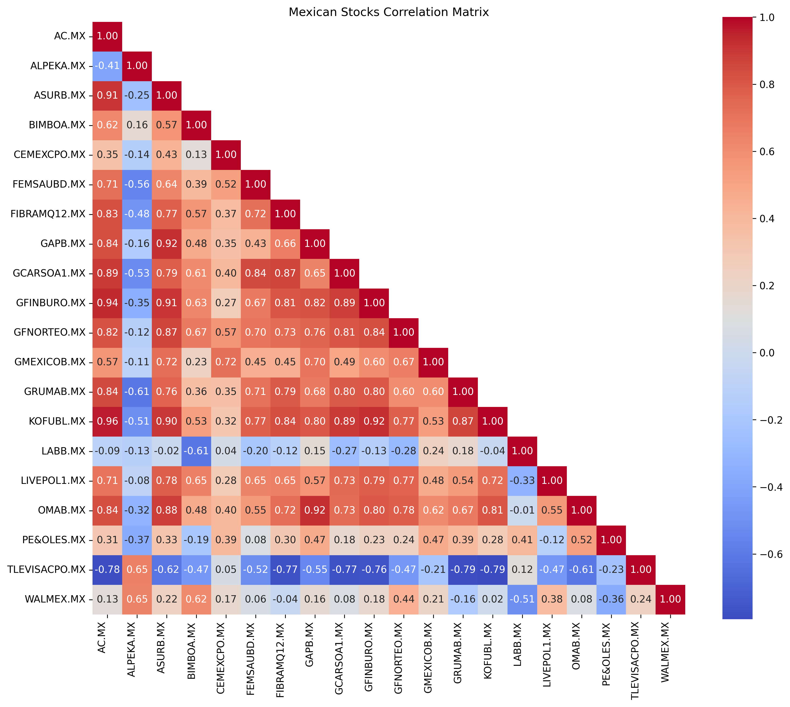
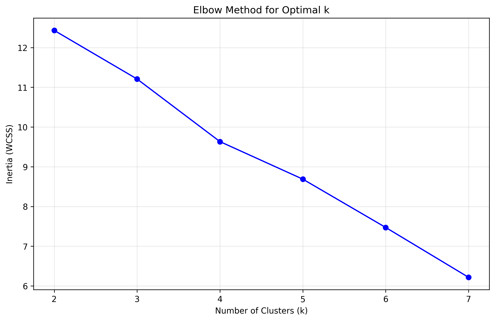

# Mexican Stock Market Analysis: Correlation Clustering and Time Series Modeling

A data science project analyzing correlation patterns among 20 major Mexican stocks using K-means clustering and linear regression forecasting.

[](https://github.com/isaacvm98/IDS706_Week2/actions)
[](https://codecov.io/gh/isaacvm98/IDS706_Week2)
[](https://github.com/psf/black)

## Project Overview

This project demonstrates fundamental data science techniques applied to financial market data, including:
- Exploratory data analysis of Mexican stock prices (2020-2025)
- Correlation-based clustering to identify stock groups with similar movement patterns
- Time series modeling to predict stock returns using linear regression

## Dataset

**Source**: Yahoo Finance API via `yfinance`  
**Period**: January 2020 - September 2025  
**Stocks**: 20 major Mexican companies across multiple sectors

### Selected Companies
- **Financial**: GFNORTEO.MX (Banorte), GFINBURO.MX (Inbursa)
- **Consumer**: WALMEX.MX (Walmart México), BIMBOA.MX (Grupo Bimbo), FEMSAUBD.MX (FEMSA)
- **Materials**: CEMEXCPO.MX (Cemex), GMEXICOB.MX (Grupo México)
- **Infrastructure**: GAPB.MX, OMAB.MX, ASURB.MX (Airport operators)
- **Others**: Televisa, Coca-Cola FEMSA, Liverpool, and more

## Key Findings

### 1. Correlation Clustering Results
Using K-means clustering (k=4) on the correlation matrix revealed four distinct groups:

| Cluster | Stock Count | Description | Stocks |
|---------|-------------|-------------|--------|
| 0 | 13 | Main Market Group | AC.MX, ASURB.MX, FEMSAUBD.MX, FIBRAMQ12.MX, GAPB.MX, GCARSOA1.MX, GFINBURO.MX, GFNORTEO.MX, GMEXICOB.MX, GRUMAB.MX, KOFUBL.MX, LIVEPOL1.MX, OMAB.MX |
| 1 | 2 | Industrial/Media Pair | ALPEKA.MX, TLEVISACPO.MX |
| 2 | 2 | Consumer Staples | BIMBOA.MX, WALMEX.MX |
| 3 | 3 | Materials/Healthcare Mix | CEMEXCPO.MX, LABB.MX, PE&OLES.MX |

### 2. Time Series Modeling
Applied linear regression to predict BIMBOA returns using WALMEX returns (Cluster 2):

**Results**:
- **R² = 0.16** (16% variance explained)
- **Beta coefficient = 0.270**
- **MSE ≈ 0.00** (very low for daily returns)
- **Equation**: BIMBOA = 0.270 × WALMEX + 0.001

**Interpretation**: For every 1% move in WALMEX, BIMBOA moves approximately 0.27% on average, indicating BIMBOA is less sensitive to systematic market movements despite being more volatile individually.

## CI/CD Pipeline

This project uses **GitHub Actions** for continuous integration with the following features:

### Automated Checks
- **Code Formatting**: Black formatter verification
- **Code Linting**: flake8 with Black-compatible settings
- **Testing**: pytest with coverage reporting
- **Multi-Python**: Testing on Python 3.11 and 3.12
- **Docker Testing**: Containerized test execution
- **Coverage Reporting**: Integration with Codecov

### Quality Gates
The CI pipeline ensures:
- All tests pass with minimum 47% coverage
- Code follows Black formatting standards
- No linting errors (syntax, undefined names)
- Docker containerization works correctly

### Local Development Commands
```bash
# Format code
make format

# Check formatting (without making changes)
make format-check

# Run linting
make lint

# Run all quality checks (format-check + lint + test)
make quality

# Simulate CI pipeline locally
make ci

## Technical Implementation

### Key Methods
1. **Data Collection**: Yahoo Finance API for historical stock prices
2. **Clustering**: K-means on correlation matrix with elbow method for optimal k
3. **Modeling**: Linear regression on daily returns (not prices) for stationarity
4. **Validation**: Train/test split with last 30 days as test set

### Testing Infrastructure

This project includes a robust testing framework to ensure code reliability:

#### Test Coverage
- **Current Coverage**: 47% (64/136 statements tested)
- **Test Categories**: Data processing, correlation analysis, clustering, time series modeling
- **Framework**: pytest with coverage reporting

#### Test Structure
```
test_stock_analysis.py
├── TestDataProcessing          # Stock data download and preprocessing
├── TestCorrelationMatrix       # Correlation calculation validation  
├── TestClustering             # K-means clustering functionality
└── TestTimeSeriesModeling     # Returns calculation and regression
```

#### Running Tests
```bash
# Run all tests with coverage
make test

# Run tests in Docker
docker-compose up test

# Generate detailed HTML coverage report
pytest --cov=basic_data_analysis --cov-report=html test_stock_analysis.py
# Then open htmlcov/index.html
```

## Methodology

### 1. Data Preprocessing
- Downloaded OHLCV data for 20 Mexican stocks using `yfinance`
- Extracted close prices using Polars for efficient data manipulation
- Calculated daily returns using percentage change for time series modeling

### 2. Correlation Analysis
- Computed correlation matrix for all stock pairs
- Visualized using masked heatmap to show upper triangular relationships
- Applied K-means clustering to group stocks by correlation patterns

### 3. Optimal Clustering
- Used elbow method to determine optimal number of clusters (k=4)
- Analyzed inertia reduction across k=2 to k=7
- Clear elbow at k=4 indicated optimal balance of complexity vs. explanatory power

### 4. Time Series Forecasting
- Selected Cluster 2 (consumer staples) for detailed analysis
- Built linear regression model predicting BIMBOA returns from WALMEX returns
- Achieved reasonable performance for daily stock return prediction (R² = 0.16)

## Visualizations

The project generates three key visualizations:

### 1. Correlation Heatmap
Shows correlation coefficients between all stock pairs:



### 2. Elbow Plot  
Demonstrates optimal cluster selection (k=4):



### 3. Time Series Plot
Displays daily returns for Cluster 2 stocks over time:


*Daily returns comparison between BIMBOA.MX (Grupo Bimbo) and WALMEX.MX (Walmart México)*

## Business Insights

### Clustering Insights
- **Market Integration**: Most Mexican stocks (65%) cluster together, suggesting strong market-wide factors drive returns
- **Sector Logic**: Consumer staples (BIMBOA + WALMEX) form distinct cluster, confirming economic intuition
- **Ownership Effects**: Carlos Slim companies (GFINBURO + GCARSOA1) cluster with main market rather than forming separate group
- **Cross-Sector Patterns**: Clustering reveals relationships beyond traditional sector boundaries

### Financial Modeling Insights
- **R² of 0.16** is reasonable for daily stock returns (individual stocks are inherently noisy)
- **Beta of 0.270** suggests BIMBOA is more defensive than WALMEX despite higher volatility
- **Model validation** confirms correlation patterns discovered through clustering
- **Volatility decomposition** shows BIMBOA has higher idiosyncratic risk but lower systematic sensitivity

## Visualizations

The project generates three key visualizations:
1. **Correlation Heatmap**: Shows correlation coefficients between all stock pairs
2. **Elbow Plot**: Demonstrates optimal cluster selection (k=4)
3. **Time Series Plot**: Displays daily returns for Cluster 2 stocks over time

## Project Structure
```
mexican-stock-analysis/
├── .devcontainer/
│   └── devcontainer.json      # Dev container configuration
├── basic_data_analysis.py     # Main analysis script
├── requirements.txt           # Python dependencies
├── Makefile                   # Build automation
├── README.md                  # This file
├── .gitignore                 # Git ignore patterns
├── test_nb.ipynb              # Jupyter notebook with exploration and visualizations
```

## Development Environment

This project uses **VS Code Dev Containers** for consistent development environment:

### Prerequisites
- Docker Desktop
- VS Code with Dev Containers extension

### Setup Options

#### Option 1: VS Code Dev Container (Recommended for Development)
```bash
# Clone the repository
git clone <your-repo-url>
cd mexican-stock-analysis

# Open in VS Code
code .

# When prompted, "Reopen in Container" or use Command Palette:
# "Dev Containers: Reopen in Container"
```

#### Option 2: Direct Docker
```bash
# Clone the repository
git clone <your-repo-url>
cd mexican-stock-analysis

# Build and run with Docker
make docker-build
make docker-run

# Or using docker directly
docker build -t mexican-stock-analysis .
docker run --rm -v $(pwd):/app mexican-stock-analysis
```

#### Option 3: Docker Compose
```bash
# Run analysis
docker-compose up mexican-stock-analysis

# Start Jupyter Lab (accessible at http://localhost:8888)
docker-compose up jupyter

# Development mode (interactive shell)
docker-compose up -d dev
docker-compose exec dev bash
```

### Running the Analysis
```bash
# Install dependencies
make install

# Run the complete analysis
make run
# or
python basic_data_analysis.py

# Start Jupyter Lab
make notebook

# Optional: Format and lint code
make format
make lint
```

## Model Performance Context

For daily stock return prediction:
- **R² > 0.3**: Excellent performance
- **R² = 0.1-0.3**: Good performance (our result: 0.16)
- **R² < 0.1**: Weak but potentially meaningful
- **R² < 0**: Worse than random prediction

Our model's performance sits in the "good" range for this prediction task.

## Economic Interpretation

**BIMBOA (Food Manufacturing) vs WALMEX (Retail)**:
- Despite BIMBOA being 25.6% more volatile than WALMEX, it only captures 27% of WALMEX's systematic moves
- This suggests different sensitivities to macroeconomic factors despite both being consumer-focused
- Food manufacturing may be more defensive during economic uncertainty
- Retail operations may be more sensitive to consumer spending fluctuations

## Limitations and Future Work

### Current Limitations
- Simple linear model may miss non-linear relationships
- Daily frequency may contain too much noise
- Limited to correlation-based clustering only

### Future Improvements
- Implement ARIMA/GARCH models for better time series forecasting
- Add regime detection for adaptive modeling during market stress
- Include volume and volatility patterns in clustering
- Extend analysis to include fundamental data
- Create real-time monitoring dashboard

## Conclusion

This project demonstrates that machine learning can identify meaningful patterns in financial data that align with economic intuition. The correlation-based clustering revealed sector relationships while the time series modeling quantified these relationships for predictive purposes.

**Key Learning**: Correlation patterns don't always follow traditional sector boundaries. K-means discovered ownership structures (Carlos Slim companies) and business cycle relationships that pure sector analysis might miss, highlighting the value of data-driven approaches in financial analysis.

**Academic Value**: Successfully applied fundamental data science techniques (clustering, regression, model validation) to real-world financial data with interpretable and economically sensible results.