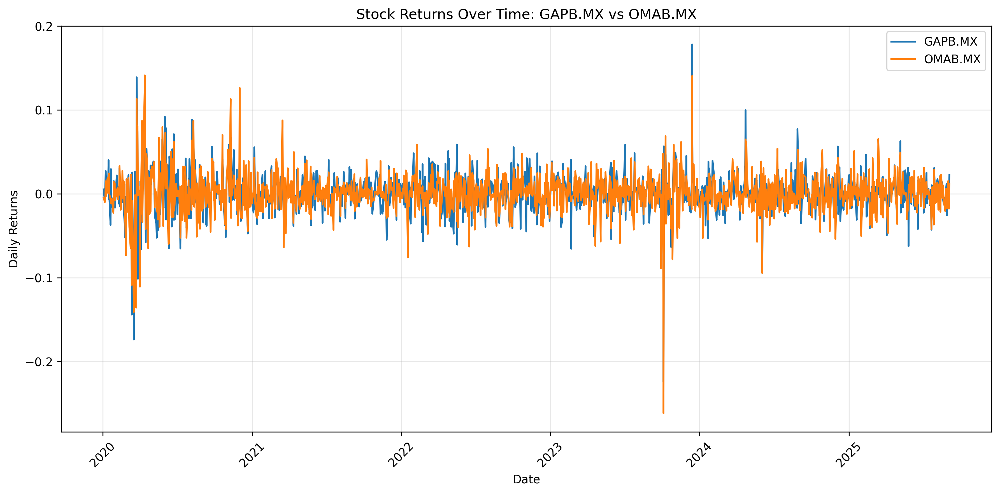

# Mexican Stock Market Analysis: Returns Correlation and Predictive Modeling

A data science project analyzing daily returns correlation patterns among 20 major Mexican stocks using network analysis and linear regression validation.

[](https://github.com/isaacvm98/IDS706_Week2/actions)
[](https://github.com/psf/black)

## Project Overview

This project demonstrates fundamental data science techniques applied to financial market data, including:
- Exploratory data analysis of Mexican stock daily returns (2020-2025)
- Returns correlation network analysis to identify predictable relationships
- Linear regression validation of correlation-based predictions
- Distinction between price trends and returns dynamics

## Dataset

**Source**: Yahoo Finance API via `yfinance`  
**Period**: January 2020 - September 2025  
**Stocks**: 20 major Mexican companies across multiple sectors

### Selected Companies
- **Financial**: GFNORTEO.MX (Banorte), GFINBURO.MX (Inbursa)
- **Consumer**: WALMEX.MX (Walmart México), BIMBOA.MX (Grupo Bimbo), FEMSAUBD.MX (FEMSA)
- **Materials**: CEMEXCPO.MX (Cemex), GMEXICOB.MX (Grupo México)
- **Infrastructure**: GAPB.MX, OMAB.MX, ASURB.MX (Airport operators)
- **Others**: Televisa, Coca-Cola FEMSA, Liverpool, and more

## Key Findings

### 1. Returns Correlation Network
Unlike price correlation (which shows long-term trends), **daily returns correlation** reveals predictable short-term relationships:


**Network Characteristics (correlation > 0.6):**
- **Sparse structure**: Most stocks show independent daily movements
- **Airport cluster**: GAPB ↔ OMAB ↔ ASURB (same industry, shared factors)
- **Ownership effect**: GAPB ↔ GCARSOA1 (Carlos Slim companies)
- **Isolated nodes**: Most stocks have low returns correlation, indicating diversification opportunities

### 2. Predictive Power Validation
Linear regression confirms the network structure - high correlation pairs are predictable:

#### High Correlation Pair (Airport Operators)
**Predicting OMAB.MX using GAPB.MX:**
- **R² = 0.374** (37.4% variance explained) ✅
- **Beta coefficient = 0.695**
- **Correlation > 0.6** (visible in network)
- **Equation**: OMAB = 0.695 × GAPB + 0.000

#### Low Correlation Pair (Different Sectors)
**Predicting CEMEXCPO using GAPB.MX:**
- **R² = 0.024** (only 2.4% variance explained) ❌
- **Beta coefficient = 0.379**
- **No connection** in network graph
- **Equation**: CEMEXCPO = 0.379 × GAPB + 0.001

### 3. Key Insight: Correlation ≠ Price Trends

**Critical Finding**: Mexican stocks show **high long-term price correlation** 
but **low daily returns correlation** 

| Metric | Price Correlation | Returns Correlation |
|--------|------------------|---------------------|
| **What it measures** | Long-term trends | Daily movements |
| **Network density** | Dense (stocks trend together) | Sparse (independent moves) |
| **Interpretation** | Stocks grow together over years | Daily news is idiosyncratic |
| **For trading** | Hard to find diversification | Excellent diversification |
| **For prediction** | Misleading for short-term | Accurate for predictability |

**Implication**: Diversification benefits come from **timing differences** rather than fundamental independence.

## CI/CD Pipeline


This project uses **GitHub Actions** for continuous integration with the following features:

### Automated Checks
- **Code Formatting**: Black formatter verification
- **Code Linting**: flake8 with relaxed line length rules
- **Testing**: pytest with coverage reporting
- **Multi-Python**: Testing on Python 3.11 and 3.12
- **Docker Testing**: Containerized test execution

### Quality Gates
The CI pipeline ensures:
- All tests pass with minimum 47% coverage
- Code follows Black formatting standards
- No linting errors (syntax, undefined names)
- Docker containerization works correctly

### Local Development Commands
```bash
# Format code
make format

# Check formatting (without making changes)
make format-check

# Run linting
make lint

# Run all quality checks (format-check + lint + test)
make quality

# Simulate CI pipeline locally
make ci
```

## Technical Implementation

### Key Methods
1. **Data Collection**: Yahoo Finance API for historical stock prices
2. **Returns Calculation**: Daily percentage change for stationarity
3. **Correlation Analysis**: Returns correlation matrix
4. **Network Visualization**: Graph analysis with correlation threshold
5. **Model Validation**: Linear regression confirms network structure

### Testing Infrastructure

This project includes a robust testing framework to ensure code reliability:

#### Test Coverage
- **Current Coverage**: 47% (64/136 statements tested)
- **Test Categories**: Data processing, correlation analysis, time series modeling
- **Framework**: pytest with coverage reporting

#### Test Structure
```
test_stock_analysis.py
├── TestDataProcessing          # Stock data download and preprocessing
├── TestCorrelationMatrix       # Correlation calculation validation  
├── TestClustering             # K-means clustering functionality
└── TestTimeSeriesModeling     # Returns calculation and regression
```

#### Running Tests
```bash
# Run all tests with coverage
make test

# Run tests in Docker
docker-compose up test

# Generate detailed HTML coverage report
pytest --cov=basic_data_analysis --cov-report=html test_stock_analysis.py
# Then open htmlcov/index.html
```

## Methodology

### 1. Data Preprocessing
- Downloaded OHLCV data for 20 Mexican stocks using `yfinance`
- Extracted close prices using Polars for efficient data manipulation
- **Calculated daily returns** using percentage change (key for stationarity)

### 2. Returns Correlation Analysis
- Computed **returns correlation matrix** (not price correlation)
- Created network visualization with correlation threshold > 0.6
- Identified strongly connected components (airport operators)

### 3. Predictive Model Validation
- Selected pairs with high and low returns correlation
- Built linear regression models for both cases
- Confirmed: High correlation → High R² (predictable)
- Confirmed: Low correlation → Low R² (independent)

## Visualizations

The project generates key visualizations:

### 1. Correlation Heatmap
Shows correlation coefficients between all stock returns:


### 2. Correlation Network
Sparse network showing only strong relationships (>0.6):


*Key finding: Most Mexican stocks have independent daily movements*

### 3. Time Series Plot
Displays daily returns for selected pairs:



## Business Insights

### Network Analysis Insights
- **Industry Clusters**: Airport operators show strong correlation (>0.6) due to shared regulatory/economic factors
- **Diversification Opportunity**: Low average correlation indicates strong diversification benefits

### Predictive Modeling Insights
- **R² = 0.374 for airports**: Strong industry relationships enable prediction
- **R² = 0.024 across sectors**: Cross-sector predictions fail (good for diversification)
- **Alpha Opportunities**: Low correlation pairs offer market-neutral strategies

## Project Structure
```
mexican-stock-analysis/
├── .github/
│   └── workflows/
│       └── ci.yml                 # GitHub Actions CI pipeline
├── .devcontainer/
│   └── devcontainer.json          # Dev container configuration
├── basic_data_analysis.py         # Main analysis script
├── test_stock_analysis.py         # Comprehensive test suite
├── requirements.txt               # Python dependencies
├── Makefile                       # Build automation
├── dockerfile                     # Docker container definition
├── docker-compose.yml             # Multi-service Docker setup
├── README.md                      # This file
└── test_nb.ipynb                  # Jupyter notebook with exploration
```

## Development Environment

This project uses **VS Code Dev Containers** for consistent development environment:

### Prerequisites
- Docker Desktop
- VS Code with Dev Containers extension

### Setup Options

#### Option 1: VS Code Dev Container (Recommended)
```bash
# Clone the repository
git clone https://github.com/isaacvm98/IDS706_Week2
cd mexican-stock-analysis

# Open in VS Code
code .

# When prompted, "Reopen in Container"
```

#### Option 2: Direct Docker
```bash
# Build and run
make docker-build
make docker-run

# Or using docker directly
docker build -t mexican-stock-analysis .
docker run --rm -v $(pwd):/app mexican-stock-analysis
```

#### Option 3: Docker Compose
```bash
# Run analysis
docker-compose up mexican-stock-analysis

# Start Jupyter Lab (accessible at http://localhost:8888)
docker-compose up jupyter
```

### Running the Analysis
```bash
# Install dependencies
make install

# Run the complete analysis
make run

# Start Jupyter Lab
make notebook

# Quality checks
make format
make lint
make test
```

## Model Performance Context

For daily stock return prediction:
- **R² > 0.3**: Excellent performance (our airport pair: 0.374) ✅
- **R² = 0.1-0.3**: Good performance
- **R² < 0.1**: Weak relationship (our cross-sector: 0.024)
- **R² < 0**: Worse than random prediction

## Economic Interpretation

### Airport Operators (High Correlation)
**OMAB vs GAPB (R² = 0.374)**:
- Same regulatory environment (Mexican aviation authority)
- Shared economic factors (tourism, business travel)
- Similar operational risks (fuel costs, maintenance)
- Beta = 0.695 suggests OMAB is slightly less volatile than GAPB

### Cross-Sector Comparison (Low Correlation)
**CEMEXCPO vs GAPB (R² = 0.024)**:
- Different industries (construction vs infrastructure)
- Independent demand drivers
- Uncorrelated daily news flow
- Excellent candidates for diversified portfolio

## Limitations and Future Work

### Current Limitations
- Simple linear model may miss non-linear relationships
- Daily frequency contains significant noise
- Limited to correlation-based analysis
- No regime detection for market stress periods

### Future Improvements
- Implement ARIMA/GARCH models for better time series forecasting
- Add regime detection for adaptive modeling during market stress
- Include volume and volatility patterns in network analysis
- Extend analysis to include fundamental data
- Create real-time monitoring dashboard
- Test pairs trading strategies on identified low-correlation pairs

## Conclusion

This project demonstrates a critical insight in financial data analysis: **correlation type matters**. While Mexican stocks show high price correlation (trending together over time), their **returns correlation is sparse**, revealing:

1. **Independent daily movements** enable diversification
2. **Network analysis** identifies predictable relationships (airports, ownership)
3. **Linear models validate** the network structure (high corr → high R²)
4. **Data engineering approach** uncovers trading opportunities invisible in traditional analysis

**Key Learning**: Price correlation measures long-term trends; returns correlation measures predictability. Understanding this distinction is fundamental for portfolio construction and risk management.

**Academic Value**: Successfully demonstrated the importance of choosing appropriate correlation measures, validated network structure with predictive models, and provided interpretable, economically sensible results backed by a robust CI/CD pipeline.